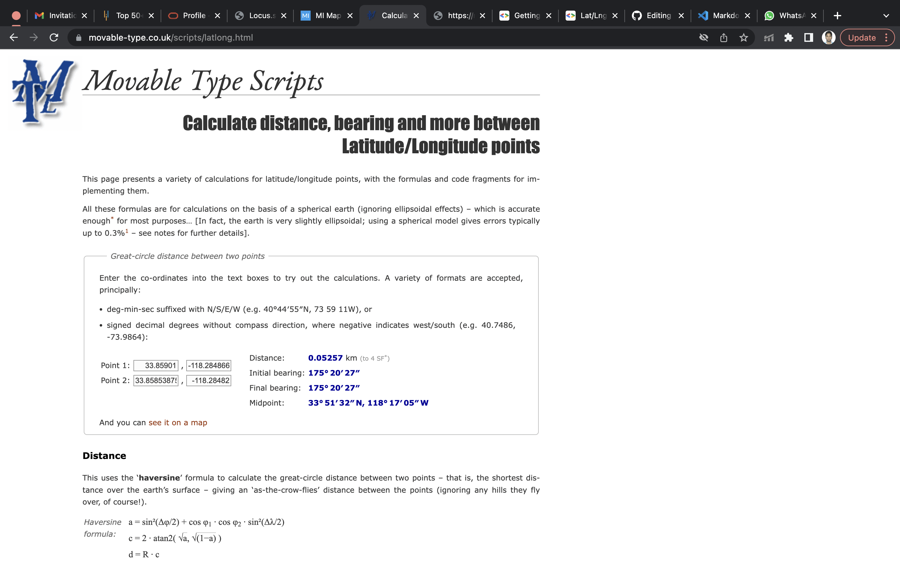
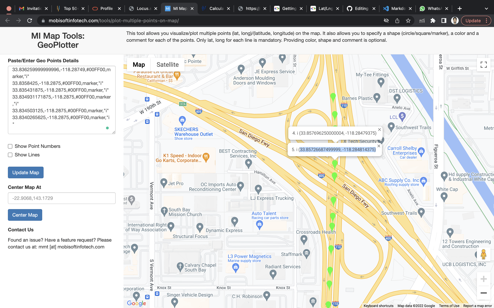
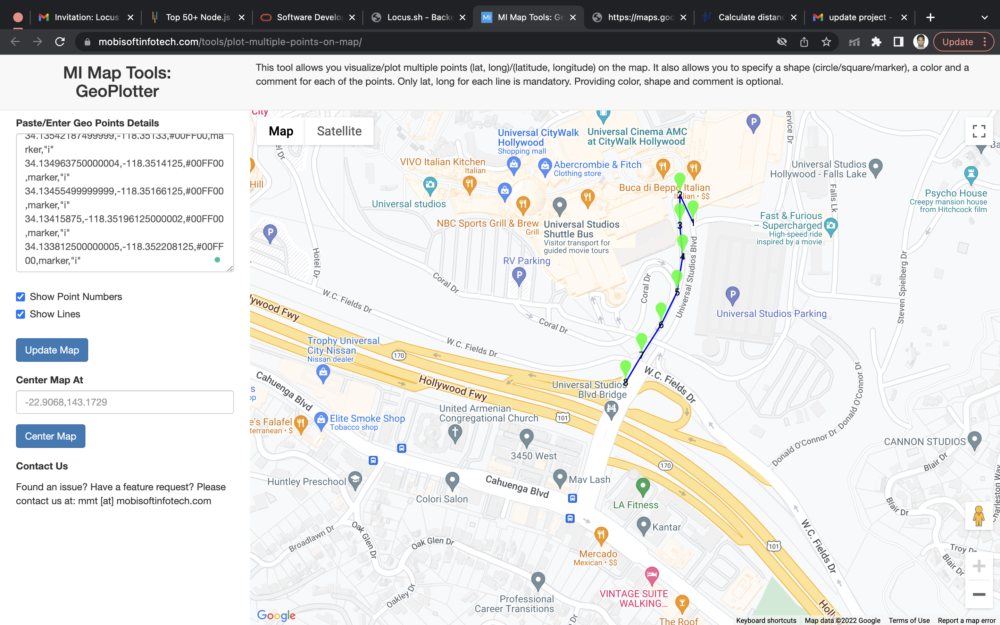

### MapApi_Project

1. To clean Mvn run :

```
mvn clean compile
```

2. To Execute run: 
```
mvn exec:java -Dexec.mainClass=MapsApi -Dexec.cleanupDaemonThreads=false


```

3. Put the Coordinates int the origin and destination respectively in the following format:( 12.93175, 77.62872).

### Images

### Approx_Distace between 2 cordinates

<br><br></br>
<br><br></br>
<br><br></br>
 
### Map_Images plotted coordinates
<br><br></br>
<br><br></br>
<br><br></br>
<br><br></br>
